# DER - PMS Hotel Boutique

Este DER documenta las 27 tablas del modelo relacional definido en `docs/database/DATABASE-DESIGN.md`. Las relaciones N:M se representan con tablas puente y no con arrays del contrato TypeScript.

```mermaid
erDiagram
    GUESTS ||--o{ BOOKINGS : realiza
    GUESTS ||--o{ GUEST_ACCOUNTS : titular
    GUESTS ||--o{ DEPOSITS : entrega
    GUESTS ||--o{ ORDERS : solicita
    GUESTS ||--o{ SERVICE_REQUESTS : solicita

    ROOM_TYPES ||--o{ ROOMS : clasifica
    ROOM_TYPES ||--o{ RATES : tarifa
    ROOM_TYPES ||--o{ BOOKINGS : reservado_como
    ROOM_TYPES ||--o{ ROOM_TYPE_FEATURES : tiene
    ROOM_FEATURES ||--o{ ROOM_TYPE_FEATURES : describe

    ROOMS ||--o{ BOOKINGS : asignada_a
    ROOMS ||--o{ ORDERS : recibe
    ROOMS ||--o{ SERVICE_REQUESTS : atiende

    RATES ||--o{ BOOKINGS : aplica

    BOOKINGS ||--o{ BOOKING_COMPANIONS : incluye
    BOOKINGS ||--|| GUEST_ACCOUNTS : abre
    BOOKINGS ||--o{ CHARGES : genera
    BOOKINGS ||--o{ PAYMENTS : recibe
    BOOKINGS ||--o{ DEPOSITS : respalda
    BOOKINGS ||--o{ ORDERS : contiene
    BOOKINGS ||--o{ SERVICE_REQUESTS : registra

    PRODUCTS ||--o{ CHARGES : origina
    PRODUCTS ||--o{ ORDER_ITEMS : vendido_como
    PRODUCTS ||--o{ INVENTORY_ITEMS : puede_controlar

    ORDERS ||--o{ ORDER_ITEMS : contiene
    CHARGES ||--o{ ORDERS : factura
    CHARGES ||--o{ SERVICE_REQUESTS : factura

    INVENTORY_ITEMS ||--o{ INVENTORY_MOVEMENTS : mueve

    CASH_SESSIONS ||--o{ CASH_MOVEMENTS : contiene
    PAYMENTS ||--o{ CASH_MOVEMENTS : registra

    ROLES ||--o{ USERS : asignado_a
    ROLES ||--o{ ROLE_PERMISSIONS : concede
    PERMISSIONS ||--o{ ROLE_PERMISSIONS : incluido_en

    USERS ||--o{ CHARGES : crea
    USERS ||--o{ PAYMENTS : procesa
    USERS ||--o{ INVENTORY_MOVEMENTS : responsable
    USERS ||--o{ CASH_SESSIONS : abre
    USERS ||--o{ CASH_SESSIONS : cierra
    USERS ||--o{ CASH_MOVEMENTS : responsable
    USERS ||--o{ AUDIT_LOGS : ejecuta

    GUESTS {
        VARCHAR id PK
        VARCHAR first_name
        VARCHAR last_name
        VARCHAR email
        VARCHAR phone
        VARCHAR nationality
        VARCHAR document_type
        VARCHAR document_number
        TEXT notes
        TIMESTAMPTZ created_at
        TIMESTAMPTZ updated_at
    }

    ROOM_TYPES {
        VARCHAR id PK
        VARCHAR code UK
        VARCHAR name
        TEXT description
        INTEGER capacity
        VARCHAR bed_configuration
        BOOLEAN active
        TIMESTAMPTZ created_at
        TIMESTAMPTZ updated_at
    }

    ROOM_FEATURES {
        VARCHAR id PK
        VARCHAR name
        TEXT description
        TIMESTAMPTZ created_at
        TIMESTAMPTZ updated_at
    }

    ROOM_TYPE_FEATURES {
        VARCHAR room_type_id PK,FK
        VARCHAR room_feature_id PK,FK
    }

    ROOMS {
        VARCHAR id PK
        VARCHAR room_number UK
        VARCHAR room_type_id FK
        INTEGER floor
        VARCHAR status
        VARCHAR housekeeping_status
        TEXT notes
        TIMESTAMPTZ created_at
        TIMESTAMPTZ updated_at
    }

    RATES {
        VARCHAR id PK
        VARCHAR room_type_id FK
        VARCHAR name
        DATE valid_from
        DATE valid_to
        BIGINT price_cents
        CHAR currency
        INTEGER minimum_nights
        BOOLEAN refundable
        BOOLEAN active
        TIMESTAMPTZ created_at
        TIMESTAMPTZ updated_at
    }

    BOOKINGS {
        VARCHAR id PK
        VARCHAR confirmation_code UK
        VARCHAR guest_link_code UK
        VARCHAR guest_id FK
        VARCHAR room_id FK
        VARCHAR room_type_id FK
        VARCHAR rate_id FK
        DATE check_in
        DATE check_out
        VARCHAR status
        INTEGER adults
        INTEGER children
        BIGINT total_amount_cents
        CHAR currency
        TEXT notes
        TIMESTAMPTZ created_at
        TIMESTAMPTZ updated_at
    }

    BOOKING_COMPANIONS {
        VARCHAR id PK
        VARCHAR booking_id FK
        VARCHAR first_name
        VARCHAR last_name
        VARCHAR document_type
        VARCHAR document_number
        VARCHAR guest_type
        TIMESTAMPTZ created_at
        TIMESTAMPTZ updated_at
    }

    GUEST_ACCOUNTS {
        VARCHAR id PK
        VARCHAR booking_id FK,UK
        VARCHAR guest_id FK
        VARCHAR status
        BIGINT balance_cents
        CHAR currency
        TIMESTAMPTZ opened_at
        TIMESTAMPTZ closed_at
        TIMESTAMPTZ created_at
        TIMESTAMPTZ updated_at
    }

    CHARGES {
        VARCHAR id PK
        VARCHAR booking_id FK
        VARCHAR product_id FK
        TEXT description
        INTEGER quantity
        BIGINT unit_price_cents
        BIGINT amount_cents
        CHAR currency
        VARCHAR category
        VARCHAR status
        TIMESTAMPTZ charged_at
        VARCHAR created_by_user_id FK
        TEXT void_reason
        TIMESTAMPTZ created_at
    }

    PAYMENTS {
        VARCHAR id PK
        VARCHAR booking_id FK
        BIGINT amount_cents
        CHAR currency
        VARCHAR method
        VARCHAR status
        VARCHAR transaction_reference
        TIMESTAMPTZ paid_at
        VARCHAR processed_by_user_id FK
        TIMESTAMPTZ created_at
    }

    DEPOSITS {
        VARCHAR id PK
        VARCHAR booking_id FK
        VARCHAR guest_id FK
        BIGINT amount_cents
        CHAR currency
        VARCHAR method
        VARCHAR status
        TIMESTAMPTZ collected_at
        TIMESTAMPTZ refunded_at
        TEXT notes
        TIMESTAMPTZ created_at
        TIMESTAMPTZ updated_at
    }

    PRODUCTS {
        VARCHAR id PK
        VARCHAR sku UK
        VARCHAR name
        TEXT description
        VARCHAR category
        BIGINT price_cents
        CHAR currency
        INTEGER stock_quantity
        INTEGER reorder_level
        BOOLEAN active
        TIMESTAMPTZ created_at
        TIMESTAMPTZ updated_at
    }

    ORDERS {
        VARCHAR id PK
        VARCHAR booking_id FK
        VARCHAR room_id FK
        VARCHAR guest_id FK
        VARCHAR status
        TEXT notes
        CHAR currency
        VARCHAR charge_id FK
        TIMESTAMPTZ requested_at
        TIMESTAMPTZ created_at
        TIMESTAMPTZ updated_at
    }

    ORDER_ITEMS {
        VARCHAR id PK
        VARCHAR order_id FK
        VARCHAR product_id FK
        INTEGER quantity
        BIGINT unit_price_cents
    }

    SERVICE_REQUESTS {
        VARCHAR id PK
        VARCHAR booking_id FK
        VARCHAR room_id FK
        VARCHAR guest_id FK
        VARCHAR type
        TEXT description
        VARCHAR status
        TEXT notes
        VARCHAR charge_id FK
        TIMESTAMPTZ requested_at
        TIMESTAMPTZ created_at
        TIMESTAMPTZ updated_at
    }

    INVENTORY_ITEMS {
        VARCHAR id PK
        VARCHAR sku UK
        VARCHAR name
        TEXT description
        VARCHAR category
        VARCHAR unit
        INTEGER current_quantity
        INTEGER minimum_quantity
        VARCHAR product_id FK
        BOOLEAN active
        TIMESTAMPTZ created_at
        TIMESTAMPTZ updated_at
    }

    INVENTORY_MOVEMENTS {
        VARCHAR id PK
        VARCHAR inventory_item_id FK
        VARCHAR type
        VARCHAR reason
        INTEGER quantity
        VARCHAR responsible_user_id FK
        TIMESTAMPTZ occurred_at
        TEXT notes
        TIMESTAMPTZ created_at
    }

    CASH_SESSIONS {
        VARCHAR id PK
        VARCHAR opened_by_user_id FK
        TIMESTAMPTZ opened_at
        BIGINT opening_balance_cents
        CHAR currency
        VARCHAR status
        VARCHAR closed_by_user_id FK
        TIMESTAMPTZ closed_at
        BIGINT expected_balance_cents
        BIGINT counted_balance_cents
        BIGINT difference_cents
        TEXT notes
        TIMESTAMPTZ created_at
        TIMESTAMPTZ updated_at
    }

    CASH_MOVEMENTS {
        VARCHAR id PK
        VARCHAR cash_session_id FK
        VARCHAR type
        VARCHAR concept
        BIGINT amount_cents
        CHAR currency
        VARCHAR responsible_user_id FK
        TIMESTAMPTZ occurred_at
        VARCHAR payment_id FK
        TIMESTAMPTZ created_at
    }

    PROMOTIONS {
        VARCHAR id PK
        VARCHAR code UK
        VARCHAR name
        TEXT description
        INTEGER discount_percent
        DATE valid_from
        DATE valid_to
        BOOLEAN active
        TIMESTAMPTZ created_at
        TIMESTAMPTZ updated_at
    }

    AMENITIES {
        VARCHAR id PK
        VARCHAR name
        TEXT description
        VARCHAR category
        VARCHAR location
        TIME opens_at
        TIME closes_at
        BOOLEAN active
        TIMESTAMPTZ created_at
        TIMESTAMPTZ updated_at
    }

    AUDIT_LOGS {
        VARCHAR id PK
        VARCHAR user_id FK
        VARCHAR module
        VARCHAR action
        VARCHAR entity_type
        VARCHAR entity_id
        TIMESTAMPTZ occurred_at
        JSONB details
        TIMESTAMPTZ created_at
    }

    PERMISSIONS {
        VARCHAR id PK
        VARCHAR key UK
        VARCHAR name
        TEXT description
        TIMESTAMPTZ created_at
        TIMESTAMPTZ updated_at
    }

    ROLES {
        VARCHAR id PK
        VARCHAR code UK
        VARCHAR name
        BOOLEAN active
        TIMESTAMPTZ created_at
        TIMESTAMPTZ updated_at
    }

    ROLE_PERMISSIONS {
        VARCHAR role_id PK,FK
        VARCHAR permission_id PK,FK
    }

    USERS {
        VARCHAR id PK
        VARCHAR first_name
        VARCHAR last_name
        VARCHAR email UK
        VARCHAR password_hash
        VARCHAR role_id FK
        VARCHAR status
        TIMESTAMPTZ created_at
        TIMESTAMPTZ updated_at
    }
```

## Lectura de cardinalidades

- `||--||`: relacion 1:1.
- `||--o{`: relacion 1:N.
- Las relaciones N:M estan normalizadas con tablas puente:
  - `ROOM_TYPES` N:M `ROOM_FEATURES` mediante `ROOM_TYPE_FEATURES`.
  - `ROLES` N:M `PERMISSIONS` mediante `ROLE_PERMISSIONS`.

## Notas de integridad del DER

- `BOOKINGS.room_id` y `BOOKINGS.rate_id` son FK opcionales.
- `RATES.valid_to` y `PROMOTIONS.valid_to` pueden ser `NULL`; `NULL` significa sin fecha de finalizacion definida. Cuando existe valor, debe cumplirse `valid_to >= valid_from`.
- `GUEST_ACCOUNTS.booking_id` es `UNIQUE` para representar 1:1 con `BOOKINGS`.
- `ORDERS.charge_id` y `SERVICE_REQUESTS.charge_id` son FK opcionales a `CHARGES`.
- `INVENTORY_ITEMS.product_id` es opcional porque producto comercial e item de inventario no son la misma entidad.
- `AUDIT_LOGS.entity_id` no tiene FK dinamica; se interpreta junto con `entity_type`.
- No existen columnas `is_assignable`, `room_feature_ids` ni `permission_ids`.
- `ORDER_ITEMS` evita guardar `Order.items` como JSON.
